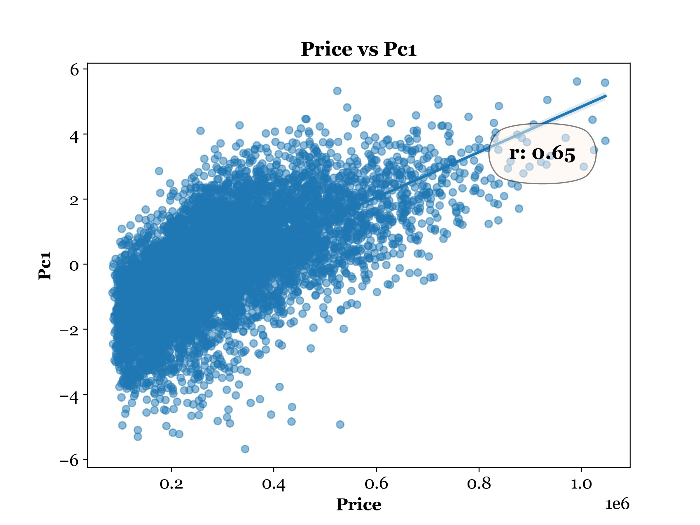
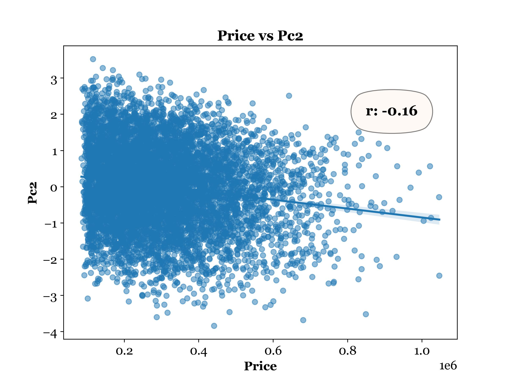
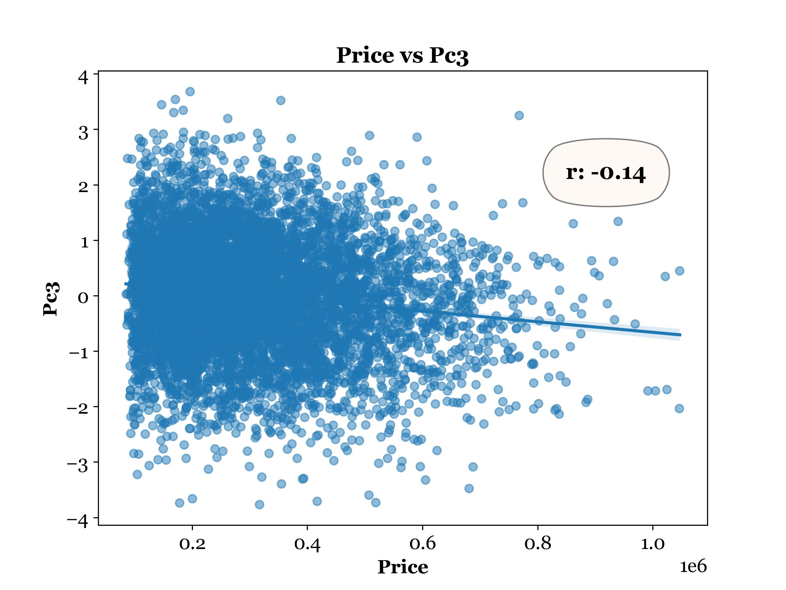
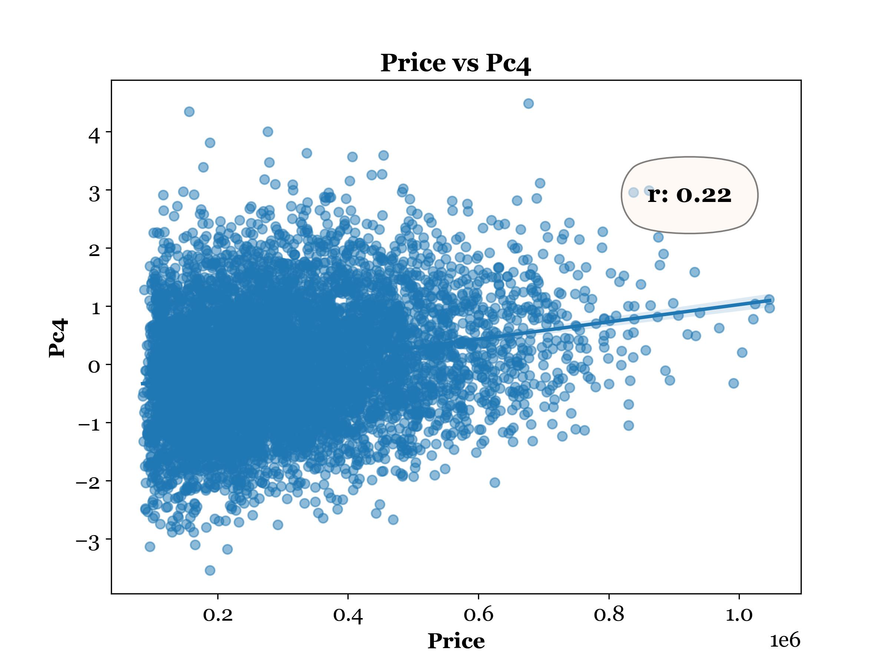
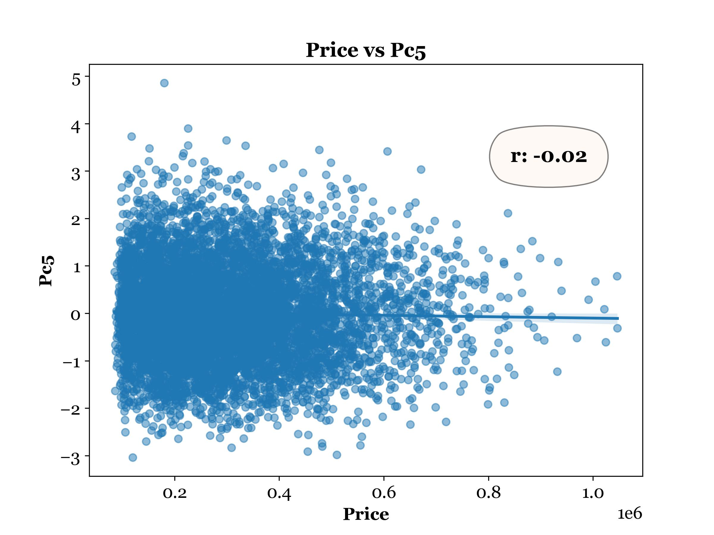
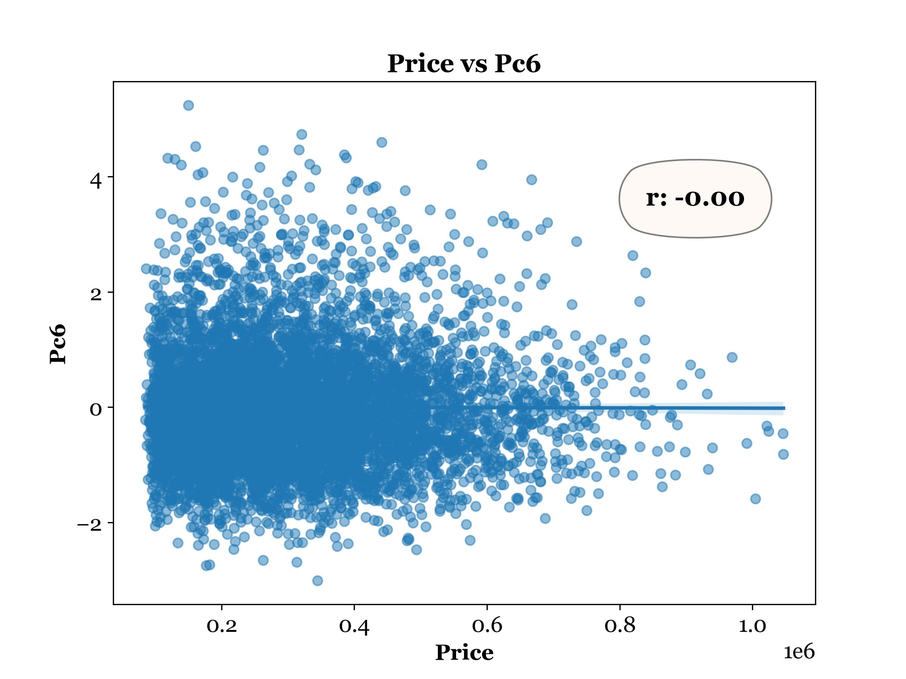

# Housing Price Prediction — Principal Component Regression (PCR)

A Principal Component Regression analysis on a housing dataset: standardizes 14 correlated continuous features, reduces them to a smaller set of uncorrelated principal components via PCA, selects significant components with forward stepwise OLS regression, and evaluates prediction accuracy on held-out test data.

> **Note on Dataset Availability**
> The dataset has been removed from this repository for data ethics reasons. All generated visualizations, scree plots, variance charts, model summaries, and residual diagnostics are retained in the `Figures/` folder for reference and portfolio purposes.

---

## Research Question

**Can housing prices be predicted from a compressed, multicollinearity-free representation of 14 correlated property features?**

---

## Why PCA Before Regression

Running OLS regression directly on 14 correlated predictors introduces multicollinearity — inflated standard errors, unstable coefficient estimates, and sensitivity to small data changes. PCA resolves this by:

- **Removing correlation:** Principal components are orthogonal by construction — zero correlation guaranteed.
- **Reducing dimensionality:** 14 features → 6 components, each capturing a distinct direction of variance.
- **Stabilizing estimates:** OLS on uncorrelated predictors produces reliable, interpretable coefficients.

The trade-off: individual components are linear combinations of all original features, so direct per-feature interpretation is lost. The gain is model stability and generalizability.

---

## Why Standardization Is Not Optional

PCA is sensitive to scale. A variable measured in square feet (range: thousands) would dominate one measured as a rate (range: 0–1) purely because its numbers are larger — regardless of how much information it actually carries.

Every variable is standardized to mean = 0, standard deviation = 1 before PCA runs. This ensures all 14 features contribute equally to the components and that the components reflect genuine patterns, not measurement units.

---

## Analysis Pipeline

1. Load dataset; drop categorical, binary, and non-continuous columns
2. Standardize all 14 continuous predictors with `StandardScaler`
3. Fit PCA on the standardized matrix; extract all eigenvalues and PC scores
4. Apply Kaiser Rule and Elbow Rule to determine how many PCs to retain
5. Visualize scree plot and variance explained per component
6. Train / test split (80 / 20) on the PC score matrix
7. Forward stepwise OLS selection to identify significant PCs
8. Train OLS on selected components; evaluate MSE on training and test sets
9. Residual diagnostic plots

---

## PC Selection — Two Rules, One Answer

| | .jpg) |  |
|---|---|---|

**Kaiser Rule:** Retain components with eigenvalue > 1 — each explains at least as much variance as one original standardized variable. Result: **6 components**.

**Elbow Rule:** Identify the natural kink in the scree plot where the slope flattens significantly. Result: **6 components**.

Both independent rules converge on the same answer. When competing selection criteria agree, the result is a meaningful signal rather than an artifact of the method.

**Forward stepwise selection** then narrowed 6 retained PCs to the **5 statistically significant** ones (p < 0.05): PC1, PC2, PC3, PC4, PC5.

---

## Regression Equation

```
Price = 308,400
      + 59,870 × PC1
      + 32,740 × PC4
      - 21,480 × PC2
      - 19,190 × PC3
      -  3,445 × PC5
```

| Model Summary |
|---|
|  |

**Coefficient interpretation:** Each coefficient describes the change in predicted price for a one-unit increase in the corresponding PC score. Components are uncorrelated, so each coefficient is independent of the others — a property plain OLS on correlated features cannot guarantee.

PC1 carries the largest positive coefficient (+59,870) and is statistically significant at p < 0.001. As the component explaining the most variance in the original feature space, its dominance here is expected.

PC4 carries a substantial positive effect (+32,740). PC2 and PC3 are both negative, indicating that the patterns they capture are inversely associated with price. All five retained PCs are statistically significant.

---

## Price vs. PC Score Scatter Plots

| PC1 | PC2 | PC3 |
|---|---|---|
|  |  |  |

| PC4 | PC5 | PC6 |
|---|---|---|
|  |  |  |

---

## Model Performance

| Metric | Value |
|---|---|
| R² | 0.514 |
| Adjusted R² | 0.514 |
| Training MSE | 11,114,897,570 |
| Test MSE | 11,933,348,804 |
| Training RMSE | ~$105,424 |
| Test RMSE | ~$109,230 |

**Generalization:** Training and test RMSE differ by only ~$3,800 — the model is not overfitting. The PC-based feature set generalizes consistently to unseen data.

**Comparison with plain OLS (Week 5):** The PCR model explains ~51% of price variance vs. ~68% in the full-feature model. The ~17% drop in R² reflects the information cost of dimensionality reduction — 14 features compressed into 5 PC scores inevitably discard some signal.

The gain: the PCR model has zero multicollinearity by construction, more stable coefficient estimates, and a simpler feature space. The choice between them depends on whether interpretability and stability or raw predictive power is the priority.

---

## Assumption Verification

| Residuals vs. Fitted Values and Autocorrelation |
|---|
|  |

**Linearity & independence:** Residuals are centered near zero with no systematic curvature. ACF values stay within confidence bands — the independence assumption is satisfied. Durbin-Watson ≈ 1.97 confirms no significant autocorrelation.

**Floor effect — a subtle but meaningful pattern:** For homes with predicted prices below ~$200,000, residuals show a sharp lower boundary — they rarely go negative. This indicates the model systematically overestimates lower-end home prices. The likely cause: a price floor in the dataset ($85,000 minimum) truncates the lower tail of the residual distribution. This is a known limitation of PCR when the target variable's range is bounded.

**Heteroscedasticity:** Residual spread increases with fitted price, suggesting the model is less precise for high-end homes. This is a known characteristic of housing price data and would benefit from a log-price transformation or a more flexible model.

---

## How to Run

```bash
pip install -r requirements.txt
python main.py
```

All standardization, PCA, model training, and figures are generated and saved to `Figures/` automatically.

---

## Project Structure

```
project/
├── data/                   # Dataset (not included — see note above)
├── Figures/                # All generated plots and model outputs
├── main.py                 # Entry point
├── requirements.txt
└── README.md
```

---

## Tech Stack

`Python` · `pandas` · `NumPy` · `Matplotlib` · `Seaborn` · `SciPy` · `statsmodels` · `scikit-learn` (`StandardScaler`, `PCA`)
