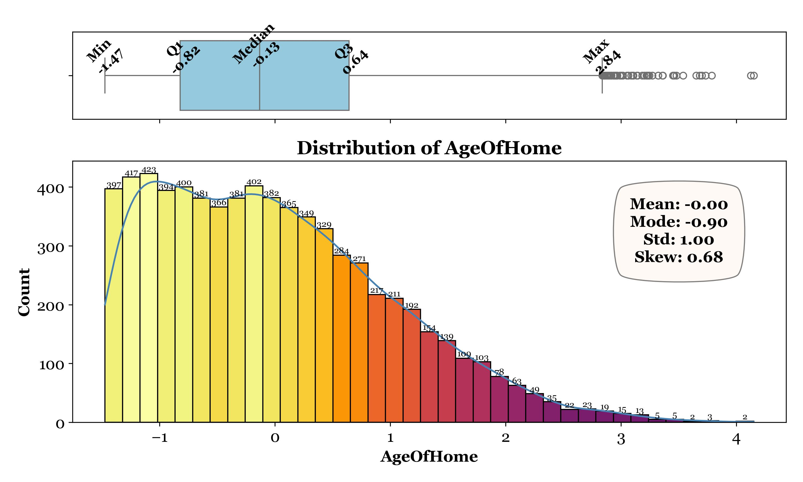
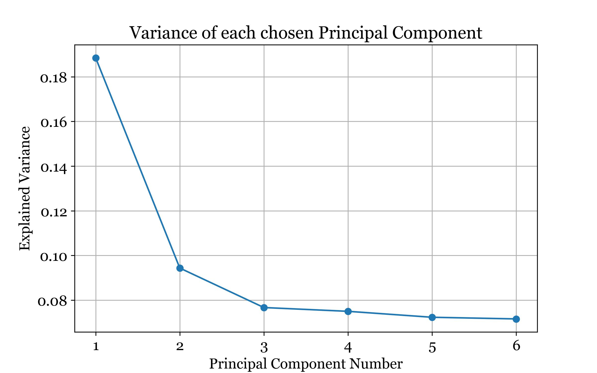
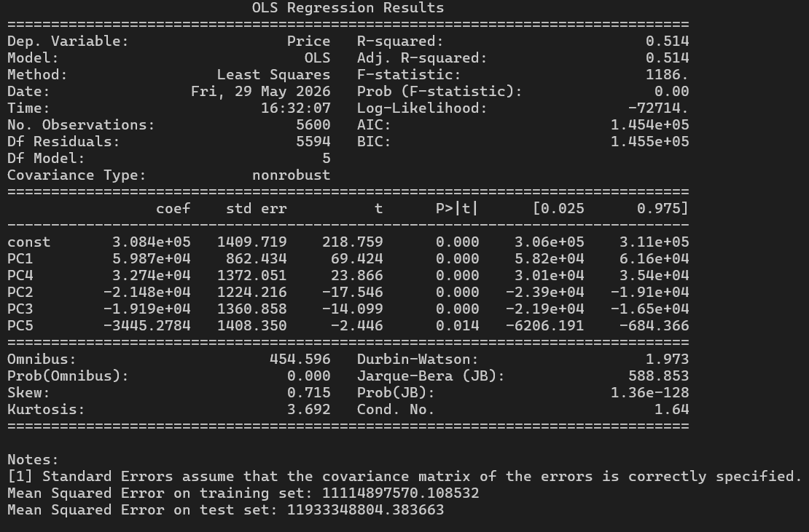
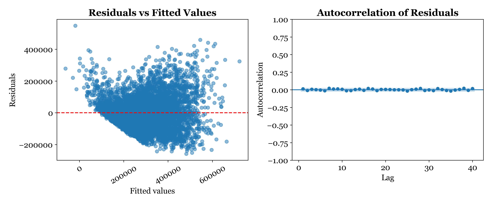

# Housing Price Prediction — Principal Component Regression (PCR)

This project applies **Principal Component Analysis (PCA)** followed by **linear regression** to predict housing prices from a set of 14 correlated continuous features. Rather than feeding raw features directly into a regression model, PCA first transforms them into a smaller set of uncorrelated principal components — eliminating multicollinearity and reducing dimensionality — before regression is applied on the reduced feature space.

The analysis covers:

- **Descriptive Statistics & Visualizations:** Distribution plots for all 14 continuous predictors.
- **Standardization:** All features scaled to zero mean and unit variance before PCA, ensuring equal contribution across variables.
- **PCA:** Full component matrix computed, with component selection guided by both the Kaiser Rule (eigenvalue > 1) and the Elbow Rule — resulting in 6 retained components.
- **Feature Selection:** Forward stepwise selection on the 6 components, retaining 5 (PC1–PC5) as statistically significant predictors.
- **Model Building & Evaluation:** Linear regression on selected PCs, evaluated using R², adjusted R², and MSE on both training and test sets.
- **Assumption Verification:** Linearity, independence of errors, and homoscedasticity checked via residual and autocorrelation plots.

> **Note on Dataset Availability**
> The raw CSV file has been removed from this repository as the data is proprietary and cannot be shared publicly. All descriptive visualizations and model outputs generated during the analysis have been retained in the `Figures/` folder for reference and presentation purposes.

---

## Analysis Summary

### Variables

- **Dependent:** `Price` (continuous — house sale price)
- **Independent (pre-PCA):** `SquareFootage`, `NumBathrooms`, `NumBedrooms`, `BackyardSpace`, `CrimeRate`, `SchoolRating`, `AgeOfHome`, `DistanceToCityCenter`, `EmploymentRate`, `PropertyTaxRate`, `RenovationQuality`, `LocalAmenities`, `TransportAccess`, `Windows`

| Sample Distribution Plots (Predictors) |
|---|
|  |

---

### PCA Results

Both the Kaiser Rule and Elbow Rule agree on retaining **6 principal components**.

| Scree Plot | Variance Explained per Component |
|---|---|
| .jpg) |  |

| Component | Eigenvalue | % Variance Explained |
|---|---|---|
| PC1 | > 1 | Largest share |
| PC2 | > 1 | — |
| PC3 | > 1 | — |
| PC4 | > 1 | — |
| PC5 | > 1 | — |
| PC6 | > 1 | — |

> Together, the 6 retained components reduce the feature space from 14 variables to 6 uncorrelated dimensions while preserving the majority of the dataset's variance.

---

### Feature Selection — Forward Stepwise on PCs

Forward stepwise selection on the 6 PCs retained **5 components** as significant predictors:

```
PC1, PC2, PC3, PC4, PC5
```

| Regression Summary Output |
|---|
|  |

---

### Regression Equation

```
Price = 308,400
      + 59,870 × PC1
      + 32,740 × PC4
      - 21,480 × PC2
      - 19,190 × PC3
      -  3,445 × PC5
```

**Coefficient highlights:**
- **PC1** has the largest positive effect — it explains the most variance and most strongly drives predicted price upward
- **PC4** is the second strongest positive predictor
- **PC2 and PC3** both negatively influence predicted price
- All five components are statistically significant (p < 0.05)
- Durbin-Watson statistic: **1.973** — no significant autocorrelation in residuals

---

### Assumption Checks

| Residuals vs. Fitted Values & Autocorrelation of Residuals |
|---|
|  |

Notable observations from the residual plot:
- A floor effect is visible for low fitted values (below ~$200K), likely due to the dataset's price minimum of $85K
- Slight heteroscedasticity detected — residual spread increases with fitted value
- No autocorrelation detected — independence assumption is satisfied

---

### Model Performance

| Metric | Training Set | Test Set |
|---|---|---|
| R² | 0.514 | — |
| Adjusted R² | 0.514 | — |
| RMSE | ~$105,424 | ~$109,230 |

> The small gap between training and test RMSE confirms good generalization. The higher RMSE compared to the full-feature regression model (Task 1) reflects the expected trade-off of dimensionality reduction — some predictive detail is sacrificed for a simpler, more stable model.

---

## How to Run

### Prerequisites

```bash
pip install -r requirements.txt
```

### Dataset Setup

Place the dataset CSV inside the `data/` folder:

```
project/
├── data/
│   └── your_dataset.csv        ← put it here
├── main.py
├── requirements.txt
└── README.md
```

### Run

```bash
python main.py
```

The script handles standardization, PCA, component selection, forward stepwise regression, assumption verification, and all visualizations automatically. Outputs and plots are saved to the `Figures/` folder.

---

## Project Structure

```
project/
├── data/                   # Raw input dataset (not included — see note above)
├── Figures/                 # Generated plots and model results
├── main.py                 # Entry point — run this
├── requirements.txt
└── README.md
```

## Key Libraries Used

| Library | Purpose |
|---|---|
| `pandas` | Data manipulation |
| `numpy` | Numerical operations |
| `matplotlib` / `seaborn` | Visualization |
| `scipy.stats` | Skewness, mode, Box-Cox transformation |
| `statsmodels` | OLS regression, model summary, MSE |
| `sklearn.decomposition.PCA` | Principal Component Analysis |
| `sklearn.preprocessing.StandardScaler` | Standardization before PCA |
| `sklearn.preprocessing.MinMaxScaler` | Supplementary normalization |
| `sklearn.model_selection.train_test_split` | Train/test split |
